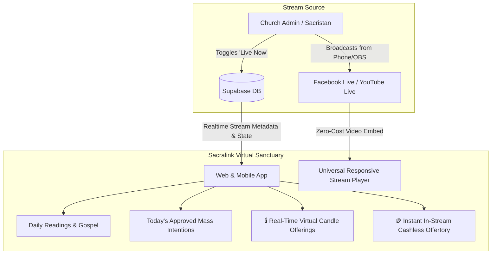

# Specification: Livestream Virtual Sanctuary (Interactive In-App Streaming)

## 1. Problem Statement
Parishioners seeking to participate in Holy Mass remotely often face significant distractions when viewing on social media platforms (Facebook, YouTube) due to algorithmic feeds, notifications, and unrelated content. Furthermore, standard video embeds fail to connect the liturgy with church-specific context (today's Gospel, mass intentions, digital offertory, and collective prayer). 

This feature transforms the simple video link into a **Virtual Sanctuary**: an ecclesiastical, distraction-free environment that combines live video feeds (powered at zero hosting cost via Facebook Live and YouTube Live embeds) with real-time sacramental features.

---

## 2. Requirements & Architecture

### A. Universal Stream Ingestion & Parsing ($0 Infrastructure)
1. **URL Auto-Detection & Sanitization**:
   - Supports **Facebook Live** (video permalinks, page live streams) using Facebook's official responsive iframe embed API.
   - Supports **YouTube Live** (video IDs, channel live streams, watch URLs) using YouTube's privacy-enhanced embed (`youtube-nocookie.com`).
2. **Offline / Standby State**:
   - When the parish is not actively broadcasting, the player displays a liturgical standby slate showing:
     - Next scheduled Mass time (derived from `mass_schedules`).
     - Church banner and priest name.
     - "Notify me when live" or link to past mass recordings.

### B. Virtual Sanctuary Ecclesiastical Companion
1. **Liturgical Readings & Daily Gospel**:
   - Tab/Drawer displaying the Daily Mass Readings (First Reading, Responsorial Psalm, Gospel) so parishioners can follow along.
2. **Parish Mass Intentions Roster**:
   - Displays approved Mass Intentions (Thanksgiving, Soul/Memorial, Special Intentions) booked through Sacralink for that day/time.
3. **Spiritual Interactions**:
   - 🕯️ **Virtual Candle Lighting**: Parishioners can light a candle offering a silent prayer. Includes a real-time collective counter synchronized via Supabase Realtime / RPC.
   - 🕊️ **Solemn "Amen" / "Peace be with you"**: Ephemeral floating prayer blessings.
4. **In-Stream Cashless Offertory ("Digital Collection Basket")**:
   - A dedicated Offertory button directly below the video that opens the church's GCash/Maya QR code and reference upload without pausing or leaving the stream.

### C. Admin Broadcast Controls & Live Indicators
1. **Admin Live Manager**:
   - Parish Admins can easily toggle **"🔴 Broadcast Live"** status, set stream title, and update stream URL from the admin dashboard.
2. **Global Live Indicators**:
   - Pulsing red badge (**"🔴 LIVE MASS"**) appears on Church Cards on `ChurchesPage.tsx`, User Dashboard, and Mobile Parish Map.

---

## 3. Architecture & Data Flow

---

## 4. Acceptance Criteria
- [ ] Universal stream parser cleanly embeds both Facebook Live and YouTube Live URLs with responsive 16:9 aspect ratio and full-screen support.
- [ ] Offline standby state displays next scheduled mass countdown and church info.
- [ ] Virtual sanctuary drawer displays daily readings, mass intentions, and interactive candle lighting with live counter sync.
- [ ] Cashless offertory drawer seamlessly integrates with existing donation workflow without interrupting video playback.
- [ ] Church Admin dashboard allows toggling live broadcast state and updating stream links with instantaneous UI updates.
- [ ] Pulsing live indicators render across Church listings on web and mobile.
