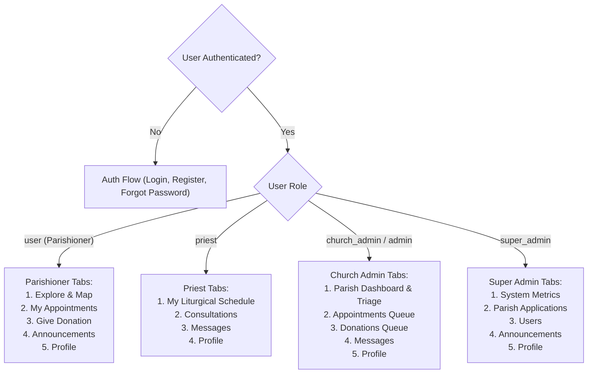

# Mobile Application Specification: SacraLink Android

> **Target Platform:** Android 10+ (API Level 29+) via React Native (Expo SDK 52/53)  
> **Package Identifier:** `com.sacralink.app`  
> **Status:** Draft / Approved from Grilling Session  
> **Author:** Antigravity & Tyrone James Bacolod  
> **Date:** September 2026  

---

## 1. Executive Summary & Objectives

SacraLink Mobile is the companion Android application for the SacraLink Church Management ecosystem. It provides **full operational parity** across all platform roles (**Parishioners, Priests, Church Admins, and Super Admins**), enabling users without access to desktop computers to participate in church operations, book sacrament appointments, verify cashless donations, engage in real-time consultations, and explore parishes on the go.

---

## 2. Technical Stack & Architecture

| Component | Technology | Rationale |
| :--- | :--- | :--- |
| **Framework** | **React Native (Expo SDK 52+)** | Rapid cross-platform native execution with OTA updates and EAS Build capabilities. |
| **Language** | **TypeScript 5.x** | Strong static typing sharing models with [`shared/types.ts`](../../shared/types.ts). |
| **Navigation** | **Expo Router v4** | File-based typed routing under `mobile/app/` supporting deep linking and Android App Links. |
| **Styling** | **NativeWind v4** | Tailwind CSS utility classes on mobile matching web HSL design system (`#2563EB` Faith Blue, `#F59E0B` Sacred Gold, `#F8FAFC` Slate). |
| **State & Data Caching** | **TanStack Query v5 (React Query)** | Automatic cache synchronization, pull-to-refresh (`onRefresh`), and offline resiliency. |
| **Backend & Realtime** | **`@supabase/supabase-js`** | Direct Postgres connection, Auth, Storage, and Supabase Realtime channels. |
| **Session Security** | **`expo-secure-store`** | Hardware-backed encrypted Android KeyStore for auth tokens. |
| **Hardware & Media** | **`expo-image-picker`**, **`expo-document-picker`**, **`expo-image-manipulator`** | Camera capture, document uploads, and client-side compression. |
| **Maps & 360° Tour** | **`react-native-webview`** | OpenStreetMap/Leaflet coordinate pinning and 360° panorama photo spheres with zero proprietary API fees. |
| **Push Alerts** | **`expo-notifications`** | Android device-level push notifications for appointment updates and donation alerts. |
| **Icons** | **`lucide-react-native`** | Direct visual consistency with the web dashboard icons. |

---

## 3. Dynamic Role-Adaptive Navigation

The mobile root navigator reads `profile.role` from `AuthContext` upon launch and renders the specialized navigation structure:

---

## 4. Feature Specifications

### 4.1. Authentication & Session Security
- Email/Password login and registration with validation (Zod).
- Unconfirmed email banner with one-click "Resend Verification Link" (`supabase.auth.resend`).
- Google OAuth via WebBrowser/Expo AuthSession.
- Session stored in hardware-encrypted `expo-secure-store`.

### 4.2. Parishioner Experience (`role: 'user'`)
1. **Explore Churches & Interactive Map**:
   - Church listing with search, category filtering, and proximity/distance sorting.
   - Interactive OpenStreetMap/Leaflet WebView showing parish pins with GPS locate-me button.
   - Church Detail View: Mass schedule timetable, contact details, priest directory, livestream embed, and 360° virtual interior tour.
2. **Sacrament & Appointment Booking Engine**:
   - Deterministic calendar checking operating hours, priest availability, and service duration constraints.
   - Dynamic document requirement checklist (Baptism certs, IDs, CENOMAR) via camera or file picker.
   - Realtime status tracker (`pending` → `approved` / `rejected` / `rescheduled` / `completed`).
3. **Cashless Donations**:
   - Display church GCash/Maya QR codes with tap-to-save.
   - Screenshot attachment picker + reference number entry.
   - Donation verification status ledger.
4. **Parishioner AI Chatbot**:
   - In-app parish assistant powered by Supabase pgvector and Gemini for instant FAQ & sacrament guidance.
5. **Real-Time Messaging & Video Consultations**:
   - 1-on-1 text chat with parish staff over Supabase Realtime channels.
   - Jitsi Meet video consultation launcher when appointments are approved for virtual counseling.

### 4.3. Priest Experience (`role: 'priest'`)
- Daily liturgical schedule & assigned sacrament appointments.
- Availability toggle (active vs off-duty slots).
- 1-on-1 pastoral messaging and virtual video consultation launcher.

### 4.4. Church Admin Experience (`role: 'church_admin' | 'admin'`)
- Mobile Triage Dashboard: Quick review counts for pending bookings and donations.
- Appointment Approval / Rejection with custom admin reason notes.
- Donation Receipt Verification: Full-screen proof image lightbox + reference number matching.
- Urgent Parish Announcement creation and broadcast.
- Full parish details & mass schedule editor.

### 4.5. Super Admin Experience (`role: 'super_admin'`)
- System-wide metrics (total parishes, active users, weekly bookings).
- Parish Application review pipeline (view church credentials, approve/reject onboarding).
- User role assignment & management.
- System-wide banner announcement authoring.

---

## 5. Non-Functional Requirements & Security
1. **Network Resilience**: TanStack Query stale-while-revalidate caching and pull-to-refresh on all list views.
2. **Security & RLS**: All Supabase calls enforce Row Level Security matching the web architecture.
3. **Asset Optimization**: Uploaded images compressed client-side to <200KB before transmission.
4. **Android Compatibility**: Android 10+ (API Level 29 to 35).
