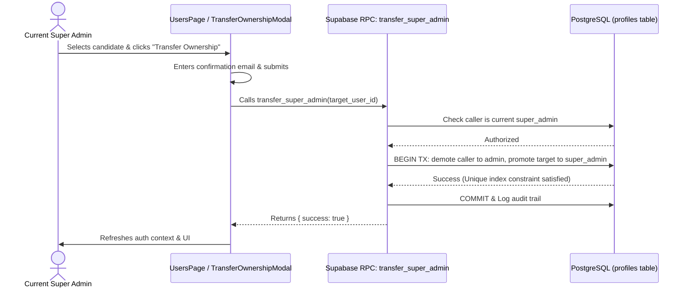

# Specification: Single Super Admin & Ownership Transfer

## 1. Problem Statement
Currently, the role management system allows any user with Super Admin privileges to assign the `super_admin` role to multiple users via the standard role dropdown. This violates the domain rule that there must be **strictly one Super Admin (the creator/owner)** of the platform at any given time. Furthermore, Super Admin access should not be grantable as an ordinary role; it can only be **transferred** from the current holder to a successor.

## 2. Requirements & Invariants

1. **Strict Singularity**:
   - The database must enforce that $\le 1$ row in `profiles` can have `role = 'super_admin'`.
   - Any attempt to insert or update a second user with `role = 'super_admin'` outside the official transfer process must be rejected by PostgreSQL.

2. **Immutable from Standard Role Pickers**:
   - The `super_admin` option must be completely removed from `availableRoles` in all role modification modals and forms (e.g. `EditRoleModal.tsx`).
   - Standard roles assignable by Super Admin: `admin`, `church_admin`, `volunteer`, `user`.
   - Standard roles assignable by Church Admin: `church_admin`, `volunteer`, `user` (scoped to their own church).

3. **Atomic Ownership Transfer RPC (`transfer_super_admin`)**:
   - A dedicated PostgreSQL `SECURITY DEFINER` function that:
     1. Verifies `auth.uid()` is the active `super_admin`.
     2. Validates that the target user exists and is active.
     3. In a single transaction:
        - Sets current Super Admin's role to `admin`.
        - Sets target user's role to `super_admin`.
        - Clears target user's `assigned_church_id` (Super Admins oversee the entire system).
        - Inserts an audit log record into `activity_logs`.

4. **Transfer Ownership UI & Safeguards**:
   - In `UsersPage.tsx`, the active Super Admin sees a distinct "Transfer Ownership" button on other eligible users' rows.
   - The Transfer modal requires:
     - Clear warning explaining the irreversibility of transferring ownership.
     - Verification step (e.g., typing the target user's email address or confirmation text).
   - The current Super Admin cannot edit or delete their own role from standard user management actions.

## 3. Architecture & Data Flow

## 4. Acceptance Criteria
- [ ] Direct SQL / Supabase updates cannot create a second `super_admin` (DB rejects via unique index constraint).
- [ ] `super_admin` is omitted from all standard role dropdowns.
- [ ] Only the active Super Admin can invoke `transfer_super_admin`.
- [ ] Successful transfer updates caller to `admin` and target to `super_admin`.
- [ ] Full UI flow works cleanly with confirmation safeguards and error handling.
